# Tutorial: Set up Eurotermbank Toolkit on Kubernetes with HELM CHART.

&nbsp;
&nbsp;
|Version|1.1|
|-----|-----------|

&nbsp;
&nbsp;

## About tutorial:
This document contains information how to run Toolkit for Eurotermbank Federated Network on Kubernetes with HELM CHART including Kubernetes set up and Helm Chart installation.


## Table of contents
1. Prerequisites
2. Kubernetes installation
3. Helm Chart installation
4. Storage configuration
5. Toolkit variable configuration
7. Toolkit Deployment

&nbsp;
&nbsp;
#### **Changes**
|Version|Publication date|Change|
|-----|-----------|-----------|
|0.1| 09.12.21 | Initial version |
|0.2| 10.12.21 | Kubernetes installation described |
|0.3| 10.12.21 | Helm installation installation described |
|0.4| 10.12.21 | Storage configuration described |
|0.5| 10.12.21 | Toolkit variable configuration described |
|0.6| 10.12.21 | Toolkit Deployment described |
|1.0| 10.12.21 | Base version described |
|1.1| 30.12.21 | Comments added |

&nbsp;
&nbsp;

## Prerequisites:
1) Linux Virtual machine
2) Sudo user
3) Internet connection
4) Open port 80 and 443 (not in use)
---
In this Tutorial we will use Ubuntu 20.04 LTS, in other Linux distributions commands may be different.

## Kubernetes installation
### Install microk8s
Connect to VM.

Run:
```bash
sudo apt update
```
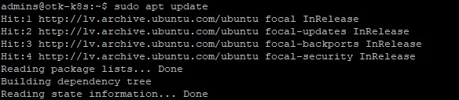

This will update Ubuntu repositories.

When repositories are updated, let's install Kubernetes.

To run Kubernetes on Ubuntu, we will use microk8s (https://microk8s.io/).

We will install kubernetes - 1.19.
Run:
```bash
sudo snap install microk8s --classic --channel=1.19/stable
```
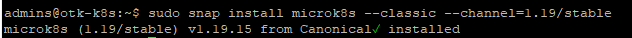

### Permissions for microk8s

We need to grant admin permissions for microk8s:

```bash
sudo usermod -a -G microk8s $USER
```
Also we need grant access to kubernetes directory for our sudo user:

```bash
sudo chown -f -R $USER ~/.kube
```

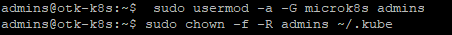


Restart terminal session, to apply changes.

### Enable kubernetes features

After succesfull microk8s installation, we need to configure Kubernetes features.

For successful Kubernetes usage, we have to enable following features:
1) DNS
2) Dashboard
3) Storage
4) Ingress

Feature can be enabled one by one:
```bash
sudo microk8s enable ingress
```

or can be enabled with a single command:

```bash
sudo microk8s enable dns dashboard storage ingress
```
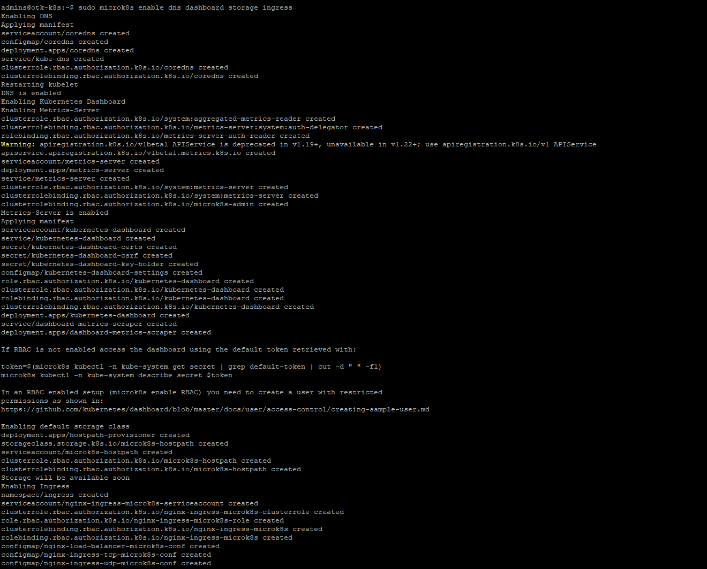

### Accessing Dashboard

Before accessing the Kubernetes Dashboard, we need to get a secret token for authentication:

Following two commands must be executed and as a result you will get the token:

```bash
token=$(microk8s kubectl -n kube-system get secret | grep default-token | cut -d " " -f1)
microk8s kubectl -n kube-system describe secret $token
```

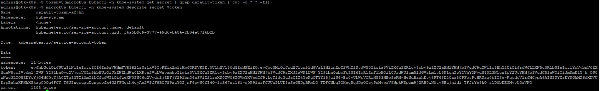

Copy and save this token for later use, it will be needed to access the Kubernetes Dashboard.

We will execute next command to set shorter alias 'kubectl':
```bash
sudo snap alias microk8s.kubectl kubectl
```

The next step is to set up port forwarding for Dashboard service. It will allow to connect the Dashboard from outside of Kubernetes cluster.

```bash
kubectl port-forward -n kube-system service/kubernetes-dashboard 18001:443 --address=0.0.0.0
```
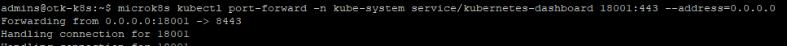

P.S. port forward command can be used for all services in kubernetes cluster.

Finaly you can connect to the Kubernetes Dashboard.

URL looks like this:

https://your-server-name:18001/#/

If you don't know your server name, you can execute this command:
```bash
hostname
```

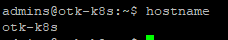


In our demo case it will be:

https://otk-k8s:18001/#/


Open the web browser and connect to the URL. If you will see error message saying somthing about not having private connection, press to proceed. Later in this tutorial we will add SSL certificate to secure the connection.

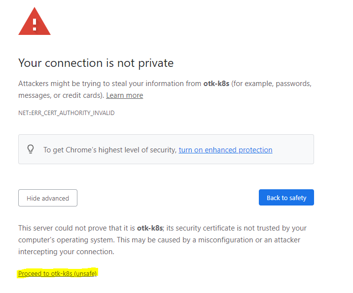


After accepting insecure connection you will see Kubernetes Dashboard login page:
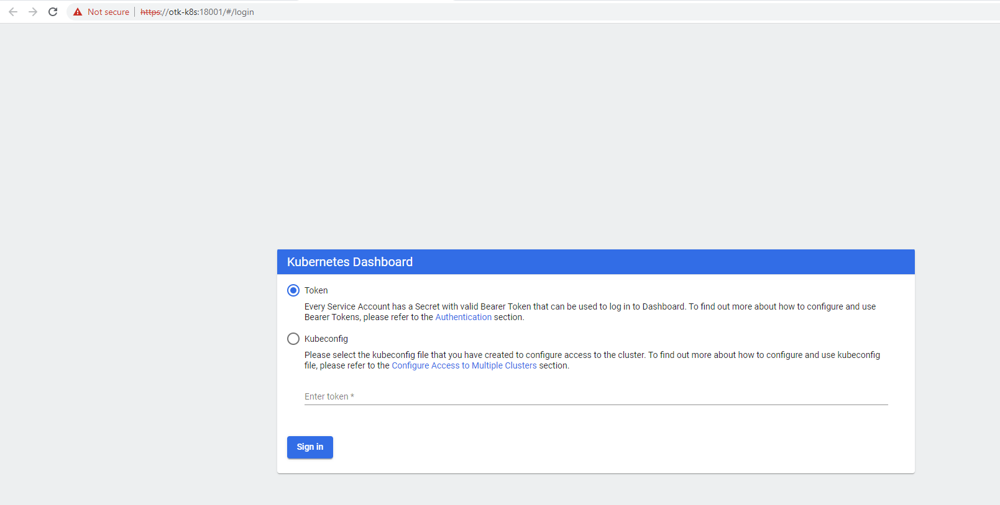


In the Dashboard choose 'Token auth method', enter the previously saved token and press Sign in.
Welcome to Dashboard:

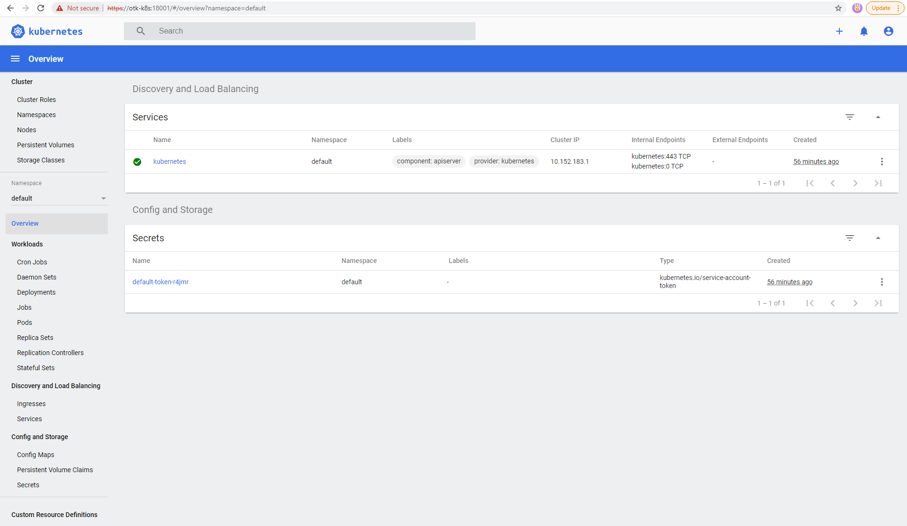

```
&nbsp;
&nbsp;

## Helm chart installation

&nbsp;
&nbsp;

Helm installations will include several commands execution.

First, we need to add helm components to Ubuntu repo:

```bash
curl https://baltocdn.com/helm/signing.asc | sudo apt-key add -
sudo apt-get install apt-transport-https --yes
echo "deb https://baltocdn.com/helm/stable/debian/ all main" | sudo tee /etc/apt/sources.list.d/helm-stable-debian.list
```

Now we need to update Ubuntu components:

```bash
sudo apt-get update
```

Finaly we need to install helm:

```bash
sudo apt-get install helm
```

You can check if helm installed by chacking it version:
```bash
helm version
```

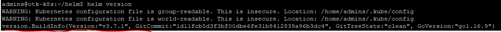


## Storage configuration

&nbsp;
&nbsp;

Toolkit require storage configuration. Storage required for MySQL.

In this tutorial we will use local shared folder.


&nbsp;
&nbsp;

MySQL storage will be used for database files.

Local paths must be under **/mnt/** folder. This is default directory for mounted storage. Overwise Kubernetes won’t be able to connect to it.

In our tutorial under **mnt** folder, we will create **otk** folder which will contain all project related folders.

Create folder for frontend:

```bash
sudo mkdir -p /mnt/otk/mysql/
```


&nbsp;
&nbsp;

## Toolkit variable configuration

&nbsp;
&nbsp;

You need to download helm chart to your server. You can find it in Git Git helm chart](https://github.com/Eurotermbank/Federated-Network-Toolkit-deployment/tree/main/helm-chart)

File name: open-toolkit-1.1.0.tgz

You need to update file with your values.

1. Open archive.

2. Find file with name **values.yaml**

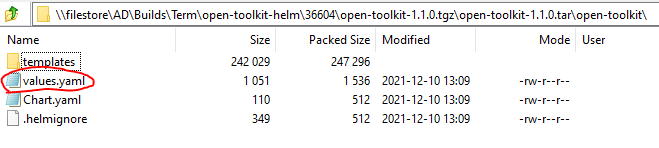

3. Now we need to update Values:

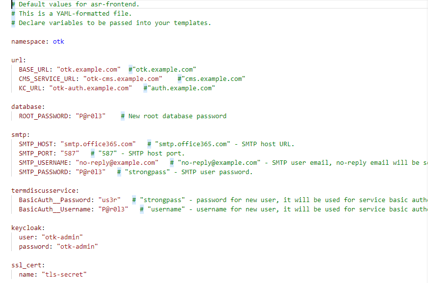

```bash

 namespace: - namespace name under what all resources will be stored.

url:
  BASE_URL: - frontend URL
  CMS_SERVICE_URL: - CMS URL
  KC_URL: - KeyCloak URL

database:
 ROOT_PASSWORD: - New root database password

smtp:
  SMTP_HOST: - SMTP host URL.
  SMTP_PORT: - SMTP host port.
  SMTP_USERNAME: - SMTP user email, no-reply email will be sended from it.
  SMTP_PASSWORD: - SMTP user password.

termdiscusservice:
  BasicAuth__Password: - password for new user, it will be used for service basic authentication.
  BasicAuth__Username: - username for new user, it will be used for service basic authentication.

keycloak:
  user: - new keycloak admin username
  password: - new keycloak admin password

ssl_cert:
  name: - SSL certificate name

```

Once Values are updated, save archive and close it.


&nbsp;
&nbsp;

## Toolkit Deployment

&nbsp;
&nbsp;


You can create separate folder helm chart. In this tutorial was created folder **helm** in home directory.


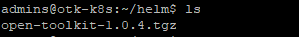

Go to helm directory.

```bash
cd helm
```


Now you can deploy it:

```bash
helm install open-toolkit open-toolkit-1.1.0.tgz
```

Check if version in cmd same as in helm chart.


If you want to update helm version:
```bash
helm upgrade open-toolkit open-toolkit-1.1.0.tgz
```

**P.S** you can perform upgrade command to same version package (for example if you perfromed advanced configuration after installation). More information can be found here: https://helm.sh/docs/helm/helm_upgrade/

Once helm deployed. You can check POD status vai Dashboard or vai cmd:

```bash
kubectl get pods --all-namespaces
```
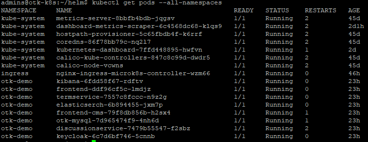


Note Keycloak pod first start can take longer then other PODS.

P.S. in some cases first start can take up 15 min or 5 min after server restart.


Once all PODS are up you can try to connect to URL's.

Some times it can take to start frontend some time.