# Tutorial: Advanced set up and configurations for Eurotermbank Toolkit on Kubernetes.

&nbsp;
&nbsp;
|Version|1.1|
|-----|-----------|

&nbsp;
&nbsp;

## About tutorial:
This document contains information how to update helm/yaml installation with advanced configuration of Toolkit for Eurotermbank Federated Network on Kubernetes.


## Table of contents

1. [MySQL](#mysql)
2. [Storage configuration](#storage)
3. [Keycloak configuration](#keycloak)
4. [Troubleshooting](#Troubleshooting)

&nbsp;
&nbsp;

## MySQL

&nbsp;
&nbsp;


When you deploy helm chart, it automaticly deploy MySQL to your kubernetes cluster.

If you dont want to use MySQL in kubernetes, you can install MySQL to your server or use your existing MySQL server.

This section will describe how to install MySQL to your server and how to import database data to your server.

Before start delete open helm chart archive and delete from there **mysql.yaml**, **mysql-storage.yaml** and **my-sql-init.yaml**.

If you want to add data to your server go to section **Creating required database**

**IMPORTANT** if you use custom MySQL server you will need update helm chart. It will be described bellow in section **Database string update**


### <a name="mysql">MySQL installation</a>

This section will go over how to install MySQL version 8.0 on an Ubuntu 20.04 server.

To install it, update the package index on your server if you’ve not done so recently:

```bash
 sudo apt update
```

Use wget command to add MySQL to Ubuntu repository:

```bash
wget -c https://repo.mysql.com/mysql-apt-config_0.8.15-1_all.deb
```

 


Before installation we need validate MySQL installation file. Execute command:

```bash
sudo dpkg -i mysql-apt-config_0.8.15-1_all.deb
```

Make sure what in **MySQL Server & Cluster** part selected **mysql-8.0**.


Then press **OK**

Next, we need to download the package lists from the repositories and "updates" them to get information on the newest versions of packages and their dependencies.
It can be performed by:

```bash
sudo apt-get update
```

Then install the mysql-server package:

```bash
sudo apt-get install mysql-server
```
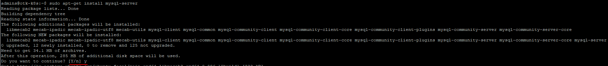

In this section please provide password for MySQL root user.


In authentication setup part, please select:
**Use legacy Authentication Method**


Legacy Authentication Method required for Strapi cms.
https://strapi.io/blog/configuring-strapi-mysql-database

After succsefull installation, we will update MySQL configuration.

Open MySQL configuration file with nano:

```bash
sudo nano /etc/mysql/mysql.conf.d/mysqld.cnf
```
Original configuration:


New parametrs will define servers collation and character set.


```bash
[mysqld]
pid-file        = /var/run/mysqld/mysqld.pid
socket          = /var/run/mysqld/mysqld.sock
datadir         = /var/lib/mysql
log-error       = /var/log/mysql/error.log
bind-address    = 0.0.0.0
#
collation-server = utf8mb4_general_ci
init-connect='SET NAMES utf8mb4'
character-set-server = utf8mb4

```

After updating, your configuration must be similar to:


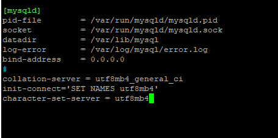


Now we need to restart MySQL to apply all changes.

```bash
sudo systemctl restart mysql
```
Once restart complete, you can check MySQL server status.

```bash
sudo service mysql status
```


&nbsp;
&nbsp;

### Creating a Dedicated MySQL User and Granting Privileges

Upon installation, MySQL creates a root user account which you can use to manage your database. This user has full privileges over the MySQL server, meaning it has complete control over every database, table, user, and so on.
Because of this, it’s best to avoid using this account outside of administrative functions.
This step outlines how to use the root MySQL user to create a new user account and grant it privileges.

We will create shell script.

```bash
sudo nano mysql-user-setup.sh
```
Fill file with configuration bellow.

```bash
#!/bin/bash
MYSQL_ROOT_PWD="root-pass"
# user: dbadmins
DBADMINUSER="db-user"
DBADMINS_PWD="db-user-pass"
mysql -u root -p$MYSQL_ROOT_PWD -e "CREATE USER '$DBADMINUSER'@'%' IDENTIFIED BY '$DBADMINS_PWD'"
mysql -u root -p$MYSQL_ROOT_PWD -e "GRANT ALL PRIVILEGES ON *.* TO '$DBADMINUSER'@'%' WITH GRANT OPTION"
```
**MYSQL_ROOT_PWD** - root user password (created in previous step)

**DBADMINUSER** - new user username

**DBADMINS_PWD** - new user password


Once script created, execute:

```bash
sudo chmod +x mysql-user-setup.sh
./mysql-user-setup.sh
```

&nbsp;
&nbsp;

### Test connection

&nbsp;
&nbsp;

For easier work with MySQL, you can use MySQL Workbench.
You can download it from [mysql workbench](https://www.mysql.com/products/workbench/ "mysql workbench") page.

In Workbench you will need define MySQL server IP address.
You can find it by executing in virtual machine:

```bash
ip a
```


Next open Workbench. And press **+** to add new connection.


Fill connection parametrs.

**Connection name** - name for connection, it can be anything (only appear in Workbench connection list).

**Hostname** - server IP.

**Username** - user (not root)

Press **Test connection**

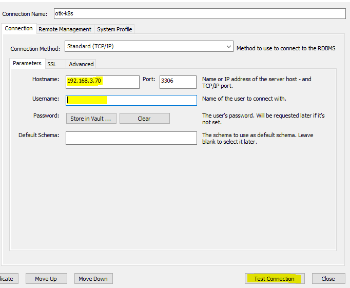

It will promt to enter **password**

If test successful, you can close configuration.

To connect to server, press to connection name.


&nbsp;
&nbsp;

### Creating required database

In this tutorial we will use Workbench to import schema data, but you can import from cmd as well.

&nbsp;
&nbsp;

There are need to configure 2 databases before deploying Toolkit.

&nbsp;
&nbsp;

#### **Keycloak database**
&nbsp;


Connect to MySQL server in Workbench.

Open Schemas tab.


Press button to create new schema.


Fill form with:

**Name** - otk-keycloak - *new database name, you can choose different, but there will be need to update install yaml*.

**Default characterset** - utf8 .

**Default collation** -  utf8_unicode_ci .

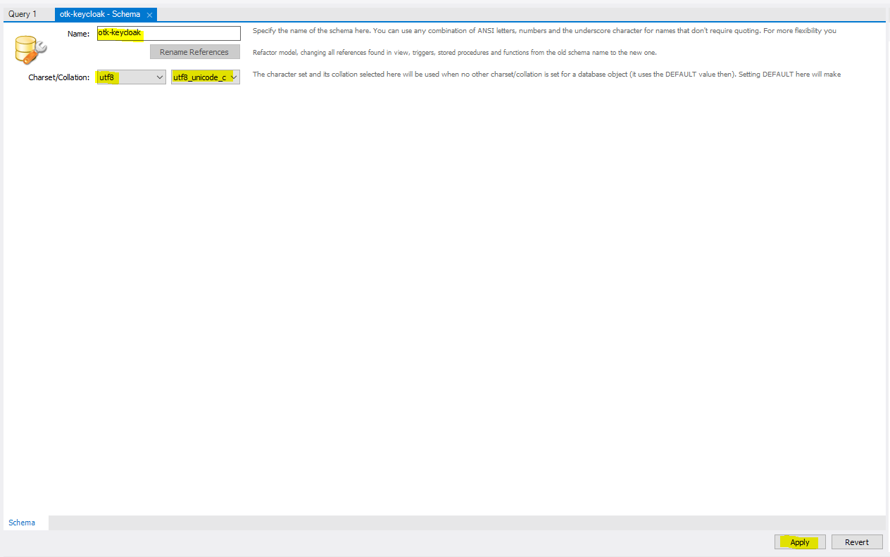

Press **Apply**

In new promt window validate if parametrs are correct and press **Apply**


Database for keycloak created.

&nbsp;
&nbsp;

#### **CMS database**

&nbsp;

In Workbench create new schema.

Fill form with:

**Name** - otk-cms - *new database name, you can choose different, but there will be need to update install yaml*.

**Default characterset** - utf8mb4.

**Default collation** -  utf8mb4_general_ci.


Press **Apply**

In new promt window validate if parametrs are correct and press **Apply**

Now we will import database from dump file.

You can find dump file in repo [cms-dump.sql](https://github.com/Eurotermbank/Federated-Network-Toolkit-deployment/blob/main/seed-data/cms/cms-dump.sql "cms-dump.sql").

Download file into same machine, there are you using Workbench.

Once dump downloaded, open **Administration** tab in Workbench.

Press **Data Import/Restore**


In **Import Options** select **Import from Self-Contained File** and locate priviosly downloaded dumb file.

In **Default Target Schema** select priviously created CMS database.

Under **Select Database Objects to Import** select **Dump Structure and Data**

Then press **Start import**


After successful import, you will see what import completed.

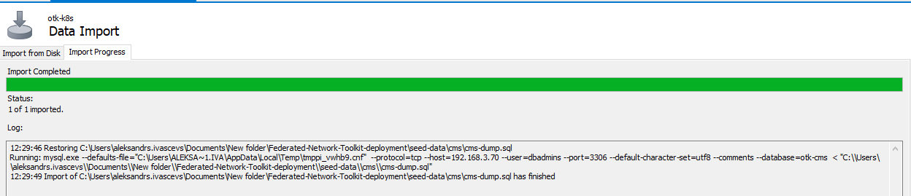


To validate if import was successful, go to Schemas tab and expose **Tables** under database.
If there are Tables, then data was successfully imported.

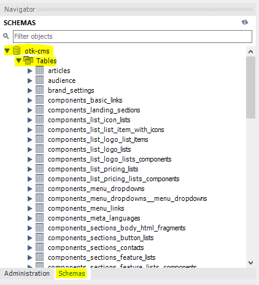

&nbsp;
&nbsp;

### Database string update

By default it is using kubernetes mysql server. If you use custom you need to update several parametrs in helm chart.

You need update configuration for 4 services.

Open helm chart archive.

#### Frontend CMS:
Open **configmap.yaml**:
In section **#frontend-cms.yaml**
Enter your data:

 **DATABASE_CLIENT** - "mysql" - define SQL server client.

 **DATABASE_HOST** - "1.1.1.1" - define SQL server IP address.

 **DATABASE_NAME** - "otk-cms" - CMS database name.

 **DATABASE_PORT** - "3306" - SQL server port.


Then open **secret.yaml**

Update in **#frontend-cms.yaml** section:

 **DATABASE_USERNAME** - "otkdbuser" - SQL server user username.

 **DATABASE_PASSWORD** - "strongpass" - SQL server user pass.

#### Keycloak:
Open **configmap.yaml**:
In section **#keycloak.yaml**
Enter your data:

 **DB_ADDR** - "1.1.1.1" - define SQL server IP address.

 **DB_DATABASE** - "otk-keycloak" - keycloak database name.

Then open **secret.yaml**

Update in **#keycloak.yaml** section:

 **DB_PASSWORD** - "otkdbuser" - SQL server user username.

 **DB_USER** - "strongpass" - SQL server user pass.

#### Termservice:

Open **_toolkit_helpers.tpl**
Find **Create ConnectionStrings__termDB** section.

Update there:
{{- $server := "1.1.1.1" -}} - define SQL server IP address.
{{- $username := "term-user" -}} - SQL server user username.
{{- $port := "3306" -}} - SQL server port.
{{- $password := "strongpass" -}} - SQL server user pass.

#### Discusionservice:

Open **_toolkit_helpers.tpl**
Find **Create ConnectionStrings__discussionDB** section.

Update there:
{{- $server := "1.1.1.1" -}} - define SQL server IP address.
{{- $username := "term-user" -}} - SQL server user username.
{{- $port := "3306" -}} - SQL server port.
{{- $password := "strongpass" -}} - SQL server user pass.


### Kubernetes MySQL default passwords update

If you want use custom passwords for your Kubernetes MySQL, you need to perfrom several steps:

First go to **mysql-init.yaml**.

Update:

For Keycloak:
```bash
CREATE USER 'kc-user'@'%' IDENTIFIED BY '5N68dLB7eRwSwPSN';
```
For Fronend CMS:
```bash
CREATE USER 'cms-user'@'%' IDENTIFIED BY '5N68dLB7eRwSwPSN';
```

For Discussionservice:
```bash
CREATE USER 'discuss-user'@'%' IDENTIFIED BY '5N68dLB7eRwSwPSN';
```

For termservice:
```bash
CREATE USER 'term-user'@'%' IDENTIFIED BY '5N68dLB7eRwSwPSN';
```

After you need update:

#### Frontend CMS:

Open **secret.yaml**

Update in **#frontend-cms.yaml** section:

 **DATABASE_USERNAME** - "otkdbuser" - SQL server user username.

 **DATABASE_PASSWORD** - "strongpass" - SQL server user pass.

#### Keycloak:
Open **secret.yaml**

Update in **#keycloak.yaml** section:

 **DB_PASSWORD** - "otkdbuser" - SQL server user username.

 **DB_USER** - "strongpass" - SQL server user pass.

#### Termservice:

Open **_toolkit_helpers.tpl**
Find **Create ConnectionStrings__termDB** section.

Update there:
{{- $username := "term-user" -}} - SQL server user username.
{{- $password := "strongpass" -}} - SQL server user pass.

#### Discusionservice:

Open **_toolkit_helpers.tpl**
Find **Create ConnectionStrings__discussionDB** section.

Update there:
{{- $username := "term-user" -}} - SQL server user username.
{{- $password := "strongpass" -}} - SQL server user pass.

&nbsp;
&nbsp;

## <a name="storage">Storage configuration</a>

&nbsp;
&nbsp;

If you want to use custom branding files or not use default docker images, when toolkit require storage configuration.

Storage can be configred for Frontend, Frontend CMS and ElasticSearch.

In this tutorial we will use local shared folder.

&nbsp;
&nbsp;

### Frontend CMS

&nbsp;
&nbsp;

Frontend CMS folder will contain all CMS files.

Folder will be located next to frontend-html folder.

```bash
sudo mkdir -p /mnt/otk/cms-public-uploads/
```

Same as for frontend, you can choose your own folder name, but dont forget update **storage.yaml** with correct local path.


For frontend CMS you need to upload files. Files located in [cms-public-uploads](https://github.com/Eurotermbank/Federated-Network-Toolkit-deployment/blob/main/seed-data/cms/cms-public-uploads.zip"cms-public-uploads.zip") .

Download .zip file into your server.

In my server .zip file located in home directory.

```bash
cd
ls
```


If in your server file located in other location, all **cd** command execute with **cd /zipfiledirectory/**.

Next install **unzip** tool.

```bash
sudo apt-get install unzip
```

Once unzip tool installed.
Execute commands to unzip archive and copy to mounted folder.
```bash
cd
sudo unzip cms-public-uploads.zip
cd uploads/
sudo cp ./* /mnt/otk/cms-public-uploads/
```

To validate if all files exist in mounted directory, execute:

```bash
ls /mnt/otk/cms-public-uploads/
```


If you dont want use local mounted folder. You can use NFS share, cloud storage. [Kubernetes official documentation](https://kubernetes.io/docs/concepts/storage/volumes)

&nbsp;
&nbsp;

Then you need to apply storage.yaml. Before apply, update both hostPath parametrs with correct path:

```bash
hostPath:
    path: "/mnt/otk/cms-public-uploads"
```

storage.yaml is located in Git [storage yaml](https://github.com/Eurotermbank/Federated-Network-Toolkit-deployment/tree/main/kubernetes/storage.yaml)


After you need update helm chart with new parametrs.
Open helm chart archive and go to frontend-cms.yaml.

In Deployemnt part there are commented **volumes** section:

```bash
#volumes:
      #- name: otk-cms-pv
      #  persistentVolumeClaim:
      #    claimName: otk-cms-claim
```
and in **volumeMounts** section:
```bash
#volumeMounts:
        #- mountPath: "/strapi/public/uploads"
        #  name: otk-cms-pv
```
Uncomment it by removing **#**. Check if PV name in **name**  and Claim name **claimName** in parametrs same as in storage.yaml in privious step.

Save archive and perform helm update.

### Frontend


&nbsp;
&nbsp;

Frontend storage will be used for portal branding. Here you can upload custom branding files.

Local paths must be under **/mnt/** folder. This is default directory for mounted storage. Overwise Kubernetes won’t be able to connect to it.

In our tutorial under **mnt** folder, we will create **otk** folder which will contain all project related folders.

Create folder for frontend:

```bash
sudo mkdir -p /mnt/otk/frontend-html/
```

You can choose your own folder name, but dont forget update **storage.yaml** with correct local path.
Command with custom path can be:

```bash
sudo mkdir -p /mnt/something/...
```

After you need update helm chart with new parametrs.
Open helm chart archive and go to frontend.yaml.

In Deployemnt part there are commented **volumes** section:

```bash
#volumes:
      #- name: otk-html-pv
      #  persistentVolumeClaim:
      #   claimName: otk-html-claim
```
and in **volumeMounts** section:
```bash
#volumeMounts:
        #- mountPath: "/usr/share/nginx/html/assets/overrides"
        #  name: otk-html-pv
```
Uncomment it by removing **#**. Check if PV name in **name**  and Claim name **claimName** in parametrs same as in storage.yaml in privious step.

Save archive and perform helm update.

&nbsp;
&nbsp;

### ElasticSearch


&nbsp;
&nbsp;

ElasticSearch storage will be used for index storing.


Create folder for ElasticSearch:

```bash
sudo mkdir -p /mnt/otk/es/
```

You can choose your own folder name, but dont forget update **storage.yaml** with correct local path.
Command with custom path can be:

```bash
sudo mkdir -p /mnt/something/...
```

After you need update helm chart with new parametrs.
Open helm chart archive and go to elasticsearch.yaml.

In Deployemnt part there are commented **volumes** section:

```bash
#volumes:
      #- name: otk-es-pv
      #  persistentVolumeClaim:
      #    claimName: otk-es-claim
```
and in **volumeMounts** section:
```bash
#volumeMounts:
        #- mountPath: "/usr/share/elasticsearch/data"
        #  name: otk-es-pv
```
Uncomment it by removing **#**. Check if PV name in **name**  and Claim name **claimName** in parametrs same as in storage.yaml in privious step.

Save archive and perform helm update.

&nbsp;
&nbsp;

## <a name="keycloak">Authentication (Keycloak) configuration</a>

&nbsp;
&nbsp;

In this section will be described how to add aditional security options and email sending for admin user in keyclaok.

Login to Keycloak portal, URL will be same, as you defined in Keycloak ingress.

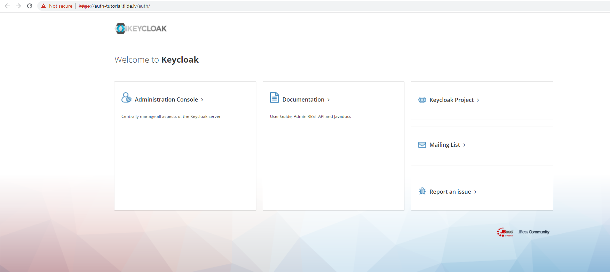


Press **Administration Console**.

Enter login and password, same as you defined in Keycloak values.


After successful login, in left corrner choose Realm **Toolkit**.

Once you select **Toolkit** it will forward you to Realm admin page.

In realm admin page, you can update several values.

### Email settings

Email settings - it can be used for example to restore password.

In right corner press to admin name and push **Manage account** button.

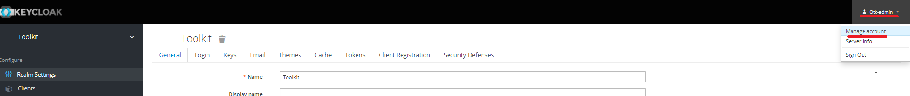

In **Account** section fill required parametrs:

**Email** - admin personal email, where you will get email from keyclok.

**First name** - admin name.

**Last name** - admin name.

Enter values and press **Save**.

After you save, in right corner press **Back to Security Admin Console**

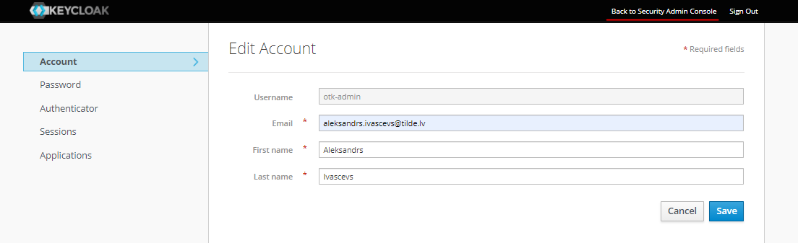


Next, in **Realm Setting** open **Email** tab.

There you need to enter your SMTP parametrs, same as you enteres for **CMS** in helm chart.


You need fill in:

**Host** - SMTP server host.

**Port** - SMTP server port.

**From** - SMTP user.

**Enable StartTLS** - ON

**Enable Authentication** - ON

**Username** - SMTP user.

**Password** - SMTP user password.


Press **Save** and you can press **Test connection** to send test email.

### JwtBearer token update

As JWT token is used Keycloak realm public key. We can use default key or generate custom. We can get this key's in admin portal. You can use default JwtBearer token or generate custom to increase security.


#### For default key:

Go to Realm settings.

Open keys tab.

Select Active.

Press Public key.

Copy key from prompt window.

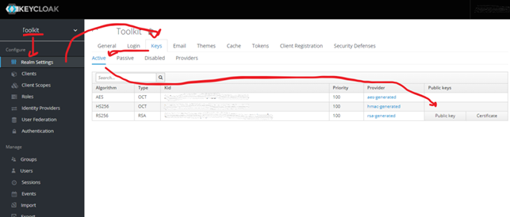

Next you need to enable JwtBearer in helm chart.
Open helm chart archive.
Go to **termservice.yaml** and uncomment  **Auth__JwtBearer__Secret** section:

```bash
#- name: Auth__JwtBearer__Secret
#  valueFrom:
#   secretKeyRef:
#    name: termservice-secret
#    key: Auth__JwtBearer__Secret
```

Same you need perform in **discussionservice.yaml**.

After need to update **secret.yaml** with key.
In .yaml find:
```bash
#Auth__JwtBearer__Secret: ""
```
uncomment line and enter your key.

After perform helm update command.

To apply change for POD go to kubenrtes Dashboard to **POD** section in **otk** namespece and delete fronend POD.


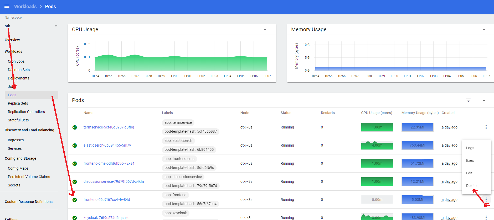


#### For custom key:

If you want to use custom key, to increase security. You can generate it in admin portal as well.

Go to Realm settings.

Open keys tab.

Select Providers.

In right corner press Add keystone…

Select rsa-generated.


Fill form:

**Console display name** – key name, it can be anything.

**Priority** – key priority, more then 100 (bigger number, bigger priority).

Mark ON for **Enable** and **Active**.

**Algorithm** and **Key** size can be default.


Open keys tab.

Select Active.

Press to old key (rsa-generated) in Provider section.


Change Enable and Active to off.

Press Public key on new key.

Copy key from prompt window.

Next you need to enable jwt in helm chart.
Open helm chart archive.
Go to **termservice.yaml** and uncomment  **Auth__JwtBearer__Secret** section:

```bash
#- name: Auth__JwtBearer__Secret
#  valueFrom:
#   secretKeyRef:
#    name: termservice-secret
#    key: Auth__JwtBearer__Secret
```

Same you need perform in **discussionservice.yaml**.

After need to update **secret.yaml** with key.
In .yaml find:
```bash
#Auth__JwtBearer__Secret: ""
```
uncomment line and enter your key.

After perform helm update command.

To apply change for POD go to kubenrtes Dashboard to **POD** section in **otk** namespece and delete fronend POD.


&nbsp;
&nbsp;

Now you can open your frontend URL in browser.

&nbsp;
&nbsp;


&nbsp;
&nbsp;

## <a name="Troubleshooting">Troubleshooting</a>

**How to regenerate Elastic Search index for terminology data?**

To recreate search index for terminology data from scratch, execute following Term service method, by providing credentials via basic authentication (see your term service configuration file for the credentials)

```
POST /api/termservice/search/reindex
Host: your-host.example.com
Authorization: Basic XXXXXXXXXX
```