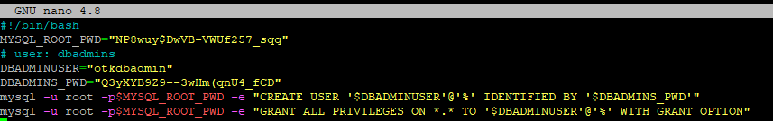
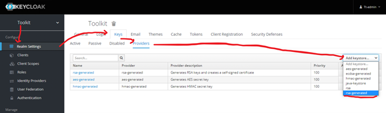

# Tutorial: Set up Eurotermbank Toolkit on Kubernetes step by step.

&nbsp;
&nbsp;
|Version|1.0|
|-----|-----------|

&nbsp;
&nbsp;

## About tutorial:
This document contains information how to run Toolkit for Eurotermbank Federated Network on Kubernetes including Kubernetes set up and MySQL installation.


## Table of contents
1. Prerequisites
2. Kubernetes installation
3. MySQL installation
4. Storage configuration
5. Toolkit variable configuration
6. Ingress/Network configuration
7. Toolkit Deployment
8. Keycloak configuration

&nbsp;
&nbsp;
#### **Changes**
|Version|Publication date|Change|
|-----|-----------|-----------|
|0.1| 28.10.21 | Initial version |
|0.2| 29.10.21 | Kubernetes installation described |
|0.3| 02.11.21 | MySQL installation described |
|0.4| 04.11.21 | Storage configuration described |
|0.5| 04.11.21 | Toolkit variable configuration described |
|0.6| 08.11.21 | Ingress/Network configuration described |
|0.7| 09.11.21 | Toolkit Deployment described |
|0.8| 10.11.21 | Keycloak configuration described |
|1.0| 15.11.21 | Minor fix|

&nbsp;
&nbsp;

## Prerequisites:
1) Linux Virtual machine
2) Sudo user
3) Internet connection
4) Open port 80 and 443 (not in use)
---
In this Tutorial we will use Ubuntu 20.04 LTS, in other Linux distributions commands may be different.

## Kubernetes installation
### Install microk8s
Connect to VM.

Run:
```bash
sudo apt update
```


This will update Ubuntu repositories.

When repositories are updated, let's install Kubernetes.

To run Kubernetes on Ubuntu, we will use microk8s (https://microk8s.io/).

We will install kubernetes - 1.19.
Run:
```bash
sudo snap install microk8s --classic --channel=1.19/stable
```


### Permissions for microk8s

We need to grant admin permissions for microk8s:

```bash
sudo usermod -a -G microk8s $USER
```
Also we need grant access to kubernetes directory for our sudo user:

```bash
sudo chown -f -R $USER ~/.kube
```


Restart terminal session, to apply changes.

### Enable kubernetes features

After succesfull microk8s installation, we need to configure Kubernetes features.

For successful Kubernetes usage, we have to enable following features:
1) DNS
2) Dashboard
3) Storage
4) Ingress

Feature can be enabled one by one:
```bash
sudo microk8s enable ingress
```

or can be enabled with a single command:

```bash
sudo microk8s enable dns dashboard storage ingress
```


### Accessing Dashboard

Before accessing the Kubernetes Dashboard, we need to get a secret token for authentication:

Following two commands must be executed and as a result you will get the token:

```bash
token=$(microk8s kubectl -n kube-system get secret | grep default-token | cut -d " " -f1)
microk8s kubectl -n kube-system describe secret $token
```


Copy and save this token for later use, it will be needed to access the Kubernetes Dashboard.

The next step is to set up port forwarding for Dashboard service. It will allow to connect the Dashboard from outside of Kubernetes cluster.

```bash
microk8s kubectl port-forward -n kube-system service/kubernetes-dashboard 18001:443 --address=0.0.0.0
```


P.S. port forward command can be used for all services in kubernetes cluster.

Finaly you can connect to the Kubernetes Dashboard.

URL looks like this:

https://your-server-name:18001/#/

If you don't know your server name, you can execute this command:
```bash
hostname
```


In our demo case it will be:

https://otk-k8s:18001/#/


Open the web browser and connect to the URL. If you will see error message saying somthing about not having private connection, press to proceed. Later in this tutorial we will add SSL certificate to secure the connection.


After accepting insecure connection you will see Kubernetes Dashboard login page:


In the Dashboard choose 'Token auth method', enter the previously saved token and press Sign in.
Welcome to Dashboard:


### Useful hacks

If you are planning to use Kubernetes from terminal. To avoid use all the time microk8s before kubectl. For example:
```bash
microk8s kubectl port-forward -n kube-system service/kubernetes-dashboard 18001:443 --address=0.0.0.0
```

You can execute this command to set shorter alias 'kubectl' or even other as you prefer:
```bash
sudo snap alias microk8s.kubectl kubectl
```

Now you can execute without microk8s:

```bash
kubectl port-forward -n kube-system service/kubernetes-dashboard 18001:443 --address=0.0.0.0
```
&nbsp;
&nbsp;

## MySQL installation

&nbsp;
&nbsp;

This section will go over how to install MySQL version 8.0 on an Ubuntu 20.04 server.

To install it, update the package index on your server if you’ve not done so recently:

```bash
 sudo apt update
```

Use wget command to add MySQL to Ubuntu repository:

```bash
wget -c https://repo.mysql.com/mysql-apt-config_0.8.15-1_all.deb
```

 


Before installation we need validate MySQL installation file. Execute command:

```bash
sudo dpkg -i mysql-apt-config_0.8.15-1_all.deb
```

Make sure what in **MySQL Server & Cluster** part selected **mysql-8.0**.


Then press **OK**

Next, we need to download the package lists from the repositories and "updates" them to get information on the newest versions of packages and their dependencies.
It can be performed by:

```bash
sudo apt-get update
```

Then install the mysql-server package:

```bash
sudo apt-get install mysql-server
```


In this section please provide password for MySQL root user.


In authentication setup part, please select:
**Use legacy Authentication Method**


Legacy Authentication Method required for Strapi cms.
https://strapi.io/blog/configuring-strapi-mysql-database

After succsefull installation, we will update MySQL configuration.

Open MySQL configuration file with nano:

```bash
sudo nano /etc/mysql/mysql.conf.d/mysqld.cnf
```
Original configuration:


New parametrs will define servers collation and character set.


```bash
[mysqld]
pid-file        = /var/run/mysqld/mysqld.pid
socket          = /var/run/mysqld/mysqld.sock
datadir         = /var/lib/mysql
log-error       = /var/log/mysql/error.log
bind-address    = 0.0.0.0
#
collation-server = utf8mb4_general_ci
init-connect='SET NAMES utf8mb4'
character-set-server = utf8mb4

```

After updating, your configuration must be similar to:


Now we need to restart MySQL to apply all changes.

```bash
sudo systemctl restart mysql
```
Once restart complete, you can check MySQL server status.

```bash
sudo service mysql status
```


&nbsp;
&nbsp;

## Creating a Dedicated MySQL User and Granting Privileges

Upon installation, MySQL creates a root user account which you can use to manage your database. This user has full privileges over the MySQL server, meaning it has complete control over every database, table, user, and so on.
Because of this, it’s best to avoid using this account outside of administrative functions.
This step outlines how to use the root MySQL user to create a new user account and grant it privileges.

We will create shell script.

```bash
sudo nano mysql-user-setup.sh
```
Fill file with configuration bellow.

```bash
#!/bin/bash
MYSQL_ROOT_PWD="root-pass"
# user: dbadmins
DBADMINUSER="db-user"
DBADMINS_PWD="db-user-pass"
mysql -u root -p$MYSQL_ROOT_PWD -e "CREATE USER '$DBADMINUSER'@'%' IDENTIFIED BY '$DBADMINS_PWD'"
mysql -u root -p$MYSQL_ROOT_PWD -e "GRANT ALL PRIVILEGES ON *.* TO '$DBADMINUSER'@'%' WITH GRANT OPTION"
```
**MYSQL_ROOT_PWD** - root user password (created in previous step)

**DBADMINUSER** - new user username

**DBADMINS_PWD** - new user password




Once script created, execute:

```bash
sudo chmod +x mysql-user-setup.sh
./mysql-user-setup.sh
```

&nbsp;
&nbsp;

### Test connection

&nbsp;
&nbsp;

For easier work with MySQL, you can use MySQL Workbench.
You can download it from [mysql workbench](https://www.mysql.com/products/workbench/ "mysql workbench") page.

In Workbench you will need define MySQL server IP address.
You can find it by executing in virtual machine:

```bash
ip a
```


Next open Workbench. And press **+** to add new connection.


Fill connection parametrs.

**Connection name** - name for connection, it can be anything (only appear in Workbench connection list).

**Hostname** - server IP.

**Username** - user (not root)

Press **Test connection**


It will promt to enter **password**

If test successful, you can close configuration.

To connect to server, press to connection name.


&nbsp;
&nbsp;

### Creating required database


&nbsp;
&nbsp;

There are need to configure 2 databases before deploying Toolkit.

&nbsp;
&nbsp;

#### **Keycloak database**
&nbsp;


Connect to MySQL server in Workbench.

Open Schemas tab.


Press button to create new schema.


Fill form with:

**Name** - otk-keycloak - *new database name, you can choose different, but there will be need to update install yaml*.

**Default characterset** - utf8 .

**Default collation** -  utf8_unicode_ci .


Press **Apply**

In new promt window validate if parametrs are correct and press **Apply**


Database for keycloak created.

&nbsp;
&nbsp;

#### **CMS database**

&nbsp;

In Workbench create new schema.

Fill form with:

**Name** - otk-cms - *new database name, you can choose different, but there will be need to update install yaml*.

**Default characterset** - utf8mb4.

**Default collation** -  utf8mb4_general_ci.


Press **Apply**

In new promt window validate if parametrs are correct and press **Apply**

Now we will import database from dump file.

You can find dump file in repo [cms-dump.sql](https://github.com/Eurotermbank/Federated-Network-Toolkit-deployment/blob/main/seed-data/cms/cms-dump.sql "cms-dump.sql").

Download file into same machine, there are you using Workbench.

Once dump downloaded, open **Administration** tab in Workbench.

Press **Data Import/Restore**


In **Import Options** select **Import from Self-Contained File** and locate priviosly downloaded dumb file.

In **Default Target Schema** select priviously created CMS database.

Under **Select Database Objects to Import** select **Dump Structure and Data**

Then press **Start import**


After successful import, you will see what import completed.


To validate if import was successful, go to Schemas tab and expose **Tables** under database.
If there are Tables, then data was successfully imported.


&nbsp;
&nbsp;


## Storage configuration

&nbsp;
&nbsp;

Toolkit require storage configuration. Storage required for Frontend and for Frontend CMS.

In this tutorial we will use local shared folder.

&nbsp;
&nbsp;
### Frontend


&nbsp;
&nbsp;

Frontend storage will be used for portal branding. Here you can upload custom branding files.

Local paths must be under **/mnt/** folder. This is default directory for mounted storage. Overwise Kubernetes won’t be able to connect to it.

In our tutorial under **mnt** folder, we will create **otk** folder which will contain all project related folders.

Create folder for frontend:

```bash
sudo mkdir -p /mnt/otk/frontend-html/
```

You can choose your own folder name, but dont forget update **storage.yaml** with correct local path.
Command with custom path can be:

```bash
sudo mkdir -p /mnt/something/...
```

&nbsp;
&nbsp;

### Frontend CMS

&nbsp;
&nbsp;

Frontend CMS folder will contain all CMS files.

Folder will be located next to frontend-html folder.

```bash
sudo mkdir -p /mnt/otk/cms-public-uploads/
```

Same as for frontend, you can choose your own folder name, but dont forget update **storage.yaml** with correct local path.


For frontend CMS you need to upload files. Files located in [cms-public-uploads](https://github.com/Eurotermbank/Federated-Network-Toolkit-deployment/blob/main/seed-data/cms/cms-public-uploads.zip"cms-public-uploads.zip") .

Download .zip file into your server.

In my server .zip file located in home directory.

```bash
cd
ls
```


If in your server file located in other location, all **cd** command execute with **cd /zipfiledirectory/**.

Next install **unzip** tool.

```bash
sudo apt-get install unzip
```

Once unzip tool installed.
Execute commands to unzip archive and copy to mounted folder.
```bash
cd
sudo unzip cms-public-uploads.zip
cd uploads/
sudo cp /mnt/otk/cms-public-uploads/ /*
```

To validate if all files exist in mounted directory, execute:

```bash
ls /mnt/otk/cms-public-uploads/
```


If you dont want use local mounted folder. You can use NFS share, cloud storage. [Kubernetes official documentation](https://kubernetes.io/docs/concepts/storage/volumes"Kubernetes-official-document")

&nbsp;
&nbsp;

## Toolkit variable configuration

&nbsp;
&nbsp;

For Toolkit deployment we are using .yaml files.
There are several types of .yaml files.

Configmap - is an API object used to store non-confidential data in key-value pairs. Pods can consume ConfigMaps as environment variables.

Service - an abstract way to expose an application running on a set of Pods as a network service.

Kustomization - defines the source of Kubernetes manifests by referencing an object managed by source-controller, the path to the Kustomization file within that source, and the interval at which the kustomize build output is applied on the cluster.

Namespace - a mechanism for isolating groups of resources within a single cluster.

Secret - an object that contains a small amount of sensitive data such as a password, a token, or a key.

Storage - Include PV and PVC. A PersistentVolume (PV) is a piece of storage in the cluster that has been provisioned by an administrator or dynamically provisioned using Storage Classes. A PersistentVolumeClaim (PVC) is a request for storage by a user. It is similar to a Pod. Pods consume node resources and PVCs consume PV resources.

Ingress - An API object that manages external access to the services in a cluster, typically HTTP. Ingress may provide load balancing, SSL termination and name-based virtual hosting


Before deploy .yaml files to Kubernetes there are need to fill required parameters into **configmap.yaml** and **secret.yaml**

All .yaml is located in Git [toolkit yaml](https://github.com/Eurotermbank/Federated-Network-Toolkit-deployment/tree/main/kubernetes"toolkit-yaml")

&nbsp;
&nbsp;


### Configmap.yaml

&nbsp;
&nbsp;


#### **frontend-cms**

&nbsp;
&nbsp;

 **DATABASE_CLIENT** - "mysql" - define SQL server client.

 **DATABASE_HOST** - "1.1.1.1" - define SQL server IP address.

 **DATABASE_NAME** - "otk-cms" - CMS database name.

 **DATABASE_PORT** - "3306" - SQL server port.

&nbsp;
&nbsp;

####  **frontend**

&nbsp;
&nbsp;

 **BASE_URL** - "https://otk.example.com" - frontend URL.

 **CMS_SERVICE_URL** - "https://cms.example.com" - frontend CMS URL.

 **TERM_SERVICE_URL** - "https://otk.example.com/api/termservice" - Term service URL.

 **KC_URL** - "https://auth.example.com/auth" - Keycloak URL.

 **KC_REALM** - "toolkit" - Keycloak Realm name.

 **KC_CLIENTID** - "otk-frontend" - keycloak client name.

 **DISCUSSION_SERVICE_URL** - "https://otk.example.com/api/discussionservice" - Discussion service URL.

&nbsp;
&nbsp;

#### **termservice**

&nbsp;
&nbsp;


 **Auth__JwtBearer__Audience** - "account" - keycloak audience. **will be deprecated**

 **Auth__JwtBearer__Issuer** - "https://**auth.example.com**/auth/realms/**toolkit**" - URL to keycloak realm. Need to update base URL **auth.example.com** and realm name **toolkit**

&nbsp;
&nbsp;

#### **keycloak**

&nbsp;
&nbsp;

 **DB_VENDOR** - "MYSQL" - define SQL server client.

 **DB_ADDR** - "1.1.1.1" - define SQL server IP address.

 **DB_DATABASE** - "otk-keycloak" - keycloak database name.

&nbsp;
&nbsp;

### secret.yaml

&nbsp;
&nbsp;

#### **frontend-cms**

&nbsp;
&nbsp;

 **DATABASE_USERNAME** - "otkdbuser" - SQL server user username.

 **DATABASE_PASSWORD** - "strongpass" - SQL server user pass.

 **SMTP_HOST** - "smtp.office365.com" - SMTP host URL.

 **SMTP_PORT** - "587" - SMTP host port.

 **SMTP_USERNAME** -  "no-reply@example.com" - SMTP user email, no-reply email will be sended from it.

 **SMTP_PASSWORD** - "strongpass" - SMTP user password.

 **SMTP_FROM** -  "no-reply@example.com" - SMTP user email, no-reply email will be sended from it.

 **SMTP_REPLYTO** -  "no-reply@example.com" - SMTP user email, no-reply email will be sended from it.

&nbsp;
&nbsp;

#### **termservice and discussionService**

&nbsp;
&nbsp;

Term service and discussion service use same secret, as they require same parameters.


 **Auth__BasicAuth__Password** - "strongpass" - password for new user, it will be used for service basic authentication.

 **Auth__BasicAuth__Username** - "username" - username for new user, it will be used for service basic authentication.

 **Auth__JwtBearer__Secret** -  "" - leave it blank for now. it will be configured later in keycloak admin portal, after we will update it.

 **ConnectionStrings__termDB** - "server=1.1.1.1;user id=dbuser;password=dbpass;persistsecurityinfo=True;database=otk-term-srv;oldguids=true;Convert Zero Datetime=True;charset=utf8" - Term database connection string. Define SQL server IP, SQL server user, SQL server user password, Term database name (you can choose db name, it will generate it).

 **ConnectionStrings__discussionDB** -  "server=1.1.1.1;user id=dbuser;password=dbpass;persistsecurityinfo=True;database=otk-discussion-srv;oldguids=true;Convert Zero Datetime=True;charset=utf8" - Discussion service database connection string. Define SQL server IP, SQL server user, SQL server user password, discussion service database name (you can choose db name, it will generate it).

 **P.S.** connection strings use MySQL default port "3306", if your SQL server use different port you can add port parameter into string. . (example: Server=myServerAddress;Port=1234;Database=myDataBase;Uid=myUsername;Pwd=myPassword;)

&nbsp;
&nbsp;

#### **keycloak**

&nbsp;
&nbsp;

 **KEYCLOAK_USER** - "username" - create new Keycloak admin username.

 **KEYCLOAK_PASSWORD** - - "strongpass" - create new Keycloak admin password.

 **DB_PASSWORD** - "otkdbuser" - SQL server user username.

 **DB_USER** - "strongpass" - SQL server user pass.

&nbsp;
&nbsp;

## Ingress/Network configuration

&nbsp;
&nbsp;

In this tutorial we are using Nginx Ingress to expose an application to the outside of your Kubernetes cluster.

We need to expose several applications.

To achive this, we will need 4 DNS name:

1) Keycloak - auth.example.com

2) Frotend CMS - strapi.example.com

3) Frontned, term service, discussion service - otk.example.com

4) Kibana - kibana.example.com. **Kibana** is optional open-source service, which allow track all services logs. Open toolkit can work without it.


You can choose your DNS name, whatever you want or what required by your organisation name policy. Its not required to use auth, otk etc.

All applications will be exposed with HTTPS.

You need to add SSL certificate to Kubernetes. If you wont add certificate, services will be available, but it will show what they are not secure.

Steps to import key to kubernetes:

First we need to create kubernetes namespace:

In this tutorail we will use namespace with name **otk**. You can use your custom name.

To create name space execute:

```bash
kubectl create namespace otk
```

To list all namespaces:

```bash
kubectl get namespace
```


Once namespace created, copy to virtual machine TLS certificate and key.

Go to certficate stored directory. Before execute command, you will need to modify it.

```bash
kubectl -n otk create secret tls aks-ingress-tls --cert=tls.crt --key=tls.key
```

**otk** - define your services namespace. you need change only **otk**. **-n** is namespace argument.

**aks-ingress-tls** - kubernetes name for imported certificate (you can choose name).

**tls.crt** - TLS certficate file name (it can be .pem, .crt or other )

**tls.key** - TLS certficate key file name (it can be .pem, .crt or other )

Once you addited command execute it.


Next you need choose DNS names for your services and register in you Domain Controller.

After your DNS names are ready, you need to update **Ingress.yaml**.

**Ingress.yaml** include network configuration for all services. In file you will need to update several parametrs.

You will need to upadate same parametrs in all configurations. Bellow will be example for Keycloak service.

```bash
apiVersion: networking.k8s.io/v1
kind: Ingress
metadata:
  name: http-ingress-keycloak
  namespace: otk
  annotations:
    kubernetes.io/ingress.class: nginx
spec:
  tls:
  - hosts:
    - auth.example.com
    secretName: aks-ingress-tls
  rules:
    - host: auth.example.com
      http:
        paths:
          - path: /
            pathType: Prefix
            backend:
              service:
                name: keycloak
                port:
                  number: 2014
status:
  loadBalancer: {}

```

Here you need to update:

**name** - you can define ingress name.

```bash
name: http-ingress-keycloak
```

**namespace** - created namespace name.

```bash
namespace: otk
```


**Hosts** -  you need to enter DNS name for your service.

```bash
- hosts:
    - auth.example.com
```


**secretName** - name of TLS certificate secret, which was created in previous steps. If you didnt create then you can leave default value.

```bash
secretName: aks-ingress-tls
```

**Host** -  you need to enter DNS name for your service.

```bash
- host: auth.example.com
```


Update all others Ingress configrurations in same way.

&nbsp;
&nbsp;

## Toolkit Deployment

&nbsp;
&nbsp;

Before deploy toolkit download all .yaml files from [Git](https://github.com/Eurotermbank/Federated-Network-Toolkit-deployment/tree/main/kubernetes"toolkit-yaml") to virtual machine.

You can create separate folder for it. In this tutorial was created folder **otk** in home directory.


First we need to create secret key for container registry.

This key will allow to download docker images from Azure Container registry.

Execute on virtual machine with correct namespace:

```bash
kubectl create secret docker-registry dregsecret \
    --namespace otk \
    --docker-server=eurotermbank.azurecr.io \
    --docker-username=bbff8f3e-176d-483a-89ef-1a17b0674abf \
    --docker-password=Pvq3OmyHlbtrpP7yGfZ3Kp9_5pt1b1-LwI
```

Once secret created, go thrue **configmap.yaml** and **secret.yaml** files and check if all values in place.

As well go thrue all .yaml files and check if there are correct namespaces defined.

**P.S.** in service's yaml (discussionservice.yaml, frontend.yaml etc.) there are defined namespace in 2 place under **Service** definition and under **Deployment** definition.


After validation values and namespace update, you can deploy services to kubernetes.

To deploy you need execute command bellow. Before executing you need to update command. In tutorial, **otk** is direcrectory name where are located all .yaml files.

```bash
cd
kubectl kustomize otk > otk/config.yaml &&  kubectl apply -k otk
```


After deployment you can check POD status.

You can check from terminal:

kubectl get pods --namespace=otk


Or you can check from Dashboard:


&nbsp;
&nbsp;

## Authentication (Keycloak) configuration

&nbsp;
&nbsp;

Once all POD's are running, we need to setup Keyclok.

Login to Keycloak portal, URL will be same, as you defined in Keycloak ingress.


Press **Administration Console**.

Enter login and password, same as you defined in Keycloak **secret.yaml** under **KEYCLOAK_PASSWORD** and **KEYCLOAK_USER** values.


After successful login, we need to configure our custom realm.

First step will be import REALM template.

Press **Master** icon at the left corner and press **Add realm**


In **Add realm** section, you need to Select temlplate file. You can find template file in [Git](https://github.com/Eurotermbank/Federated-Network-Toolkit-deployment/tree/main/seed-data/keycloak"toolkit-keycloak"). Download **toolkit.json** file. Once file downloaded select it from **Add realm** section in browser.


If you want you can choose custome Realm name, but you will need to update all values in **configmap.yaml** and in **secret.yaml** which point to Realm name.


Press **Create**.


Once Realm is created you will forwarded to Realm admin page.

In realm admin page, we need to update several values.

First we will fill Email settings. It can be used for example to restore password.

In right corner press to admin name and push **Manage account** button.


In **Account** section fill required parametrs:

**Email** - admin personal email, where you will get email from keyclok.

**First name** - admin name.

**Last name** - admin name.

Enter values and press **Save**.

After you save, in right corner press **Back to Security Admin Console**


Next, in **Realm Setting** open **Email** tab.

There you need to enter your SMTP parametrs, same as you enteres for **CMS** in **secret.yaml**.


You need fill in:

**Host** - SMTP server host.

**Port** - SMTP server port.

**From** - SMTP user.

**Enable StartTLS** - ON

**Enable Authentication** - ON

**Username** - SMTP user.

**Password** - SMTP user password.


Press **Save** and you can press **Test connection** to send test email.


Next we will update Frontend and Keycloak connections.

You need to open **Cleints** section, find **otk-frontend** end press **Edit**.


Here we need to update 3 parametrs.

Root URL - https://otk.example.com - frontend URL

Valid redirect URL - http://localhost:4200/* and https://otk.example.com/* - local host URL and frontend URL - **IMPORTANT ADD /* at the end of URL's**

Base URL - https://otk.example.com - frontend URL


Update values and press **Save**


In **secret.yaml** configuration part I have mentioned **Auth__JwtBearer__Secret** token. Now we can generete it and update **secret.yaml**.

As JWT token is used Keycloak realm public key. We can use default key or generate custom. We can get this key's in admin portal.

For default key:

Go to Realm settings.

Open keys tab.

Select Active.

Press Public key.

Copy key from prompt window.


Update **secret.yaml** with new key. And execute command to update it (check if folder name correct, same command as in deploy part):
```bash
cd
kubectl kustomize otk > otk/config.yaml &&  kubectl apply -k otk
```

To apply change for POD go to kubenrtes Dashboard to **POD** section in **otk** namespece and delete fronend POD.


For custom key:

If you want to use custom key, to increase security. You can generate it in admin portal as well.

Go to Realm settings.

Open keys tab.

Select Providers.

In right corner press Add keystone…

Select rsa-generated.




Fill form:

**Console display name** – key name, it can be anything.

**Priority** – key priority, more then 100 (bigger number, bigger priority).

Mark ON for **Enable** and **Active**.

**Algorithm** and **Key** size can be default.


Open keys tab.

Select Active.

Press to old key (rsa-generated) in Provider section.


Change Enable and Active to off.

Press Public key on new key.

Copy key from prompt window.

Update **secret.yaml** with new key. And execute command to update it (check if folder name correct, same command as in deploy part):
```bash
cd
kubectl kustomize otk > otk/config.yaml &&  kubectl apply -k otk
```

To apply change for POD go to kubenrtes Dashboard to **POD** section in **otk** namespece and delete fronend POD.


&nbsp;
&nbsp;

Now you can open your frontend URL in browser.

&nbsp;
&nbsp;
