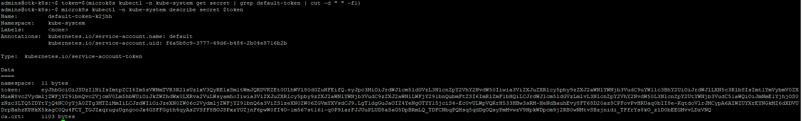

# Tutorial: Setup Toolkit on Kubernetes step by step.

&nbsp;
&nbsp;
|Version|0.2|
|-----|-----------|

&nbsp;
&nbsp;

## About tutorial:
This document contains information how to run Toolkit for Eurotermbank Federated Network on Kubernetes. In document will be described topics like Kubernetes and MySQL installations.


## Table of contents
1. Prerequisites
2. Kubernetes installation
3. MySQL installation
4. Toolkit Deployment
5. Ingress/Network configuration
6. Keycloak configuration

&nbsp;
&nbsp;
#### **Changes**
|Version|Publication date|Change|
|-----|-----------|-----------|
|0.1| 28.10.21 | Initial version |
|0.2| 29.10.21 | Kubernetes installation described |

&nbsp;
&nbsp;

## Prerequisites:
1) Linux Virtual machine
2) Sudo user
3) Internet connection
---
In this Tutorial we will use Ubuntu 20.04 LTS, in other Linux distributions commands may be different.

## Kubernetes installation
### Install microk8s
Connect to VM.

Run:
```bash
sudo apt update
```


This will update Ubuntu repositories.

When repositories are updated, let's install Kubernetes.

To run Kubernetes on Ubuntu, we will use microk8s (https://microk8s.io/).

We will install kubernetes - 1.19.
Run:
```bash
sudo snap install microk8s --classic --channel=1.19/stable
```


### Permissions for microk8s

We need to grant admin permissions for microk8s:

```bash
sudo usermod -a -G microk8s admins
```
Also we need grant access to kubernetes directory for our sudo user:

```bash
sudo chown -f -R admins ~/.kube
```


### Enable kubernetes features

After succesfull microk8s installation, we need to configure Kubernetes features.

For successful Kubernetes usage, we have to enable following features:
1) DNS
2) Dashboard
3) Storage
4) Ingress

Feature can be enabled one by one:
```bash
sudo microk8s enable ingress
```

or can be enabled with a single command:

```bash
sudo microk8s enable dns dashboard storage ingress
```


### Accessing Dashboard

Before accessing the Kubernetes Dashboard, we need to get a secret token for authentication:

Following two commands must be executed and as a result you will get the token:

```bash
token=$(microk8s kubectl -n kube-system get secret | grep default-token | cut -d " " -f1)
microk8s kubectl -n kube-system describe secret $token
```



Copy and save this token for later use, it will be needed to access the Kubernetes Dashboard.

The next step is to set up port forwarding for Dashboard service. It will allow to connect the Dashboard from outside of Kubernetes cluster.

```bash
microk8s kubectl port-forward -n kube-system service/kubernetes-dashboard 18001:443 --address=0.0.0.0
```


P.S. port forward command can be used for all services in kubernetes cluster.

Finaly you can connect to the Kubernetes Dashboard.

URL looks like this:

https://your-server-name:18001/#/

If you don't know your server name, you can execute this command:
```bash
hostname
```


In our demo case it will be:

https://otk-k8s:18001/#/


Open the web browser and connect to the URL. If you will see error message saying somthing about not having private connection, press to proceed. Later in this tutorial we will add SSL certificate to secure the connection.


After accepting insecure connection you will see Kubernetes Dashboard login page:


In the Dashboard choose 'Token auth method', enter the previously saved token and press Sign in.
Welcome to Dashboard:


### Useful hacks

If you are planning to use Kubernetes from terminal. To avoid use all the time microk8s before kubectl. For example:
```bash
microk8s kubectl port-forward -n kube-system service/kubernetes-dashboard 18001:443 --address=0.0.0.0
```

You can execute this command to set shorter alias 'kubectl' or even other as you prefer:
```bash
sudo snap alias microk8s.kubectl kubectl
```

Now you can execute without microk8s:

```bash
kubectl port-forward -n kube-system service/kubernetes-dashboard 18001:443 --address=0.0.0.0
```

## MySQL installation
 *Description in process

## Toolkit Deployment
 *Description in process
 
## Ingress/Network configuration
 *Description in process
 
## Authentication (Keycloak) configuration
 *Description in process
 
