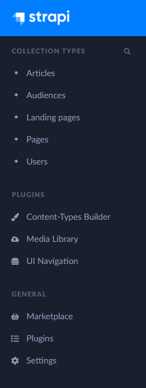
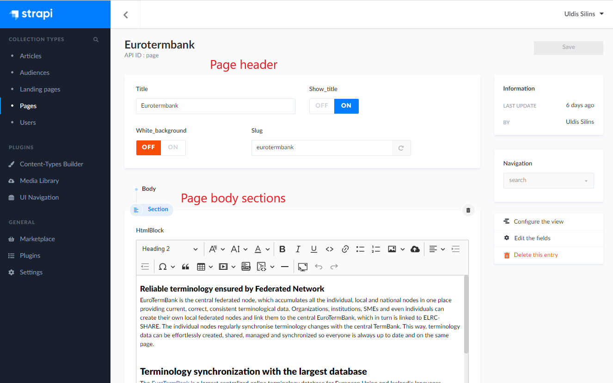
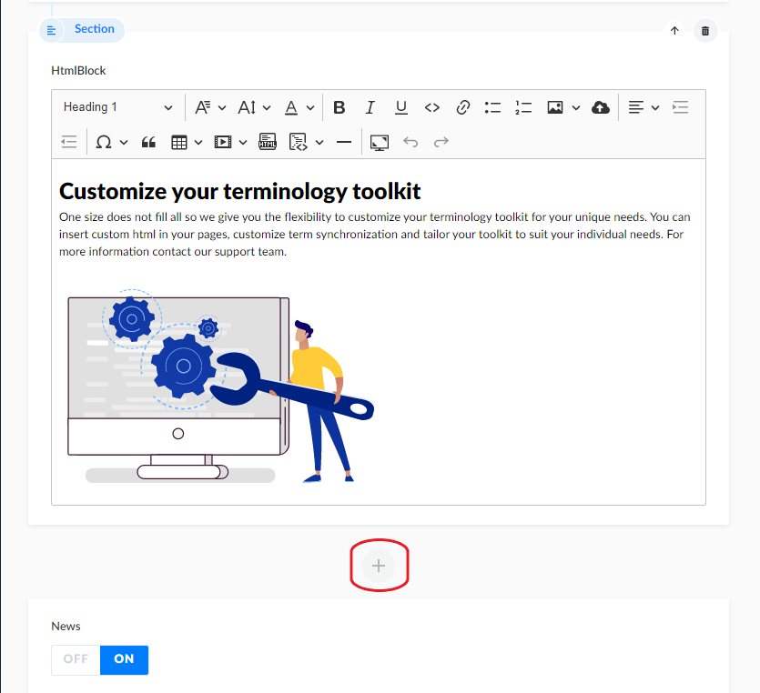
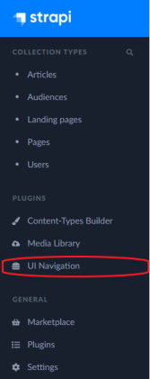
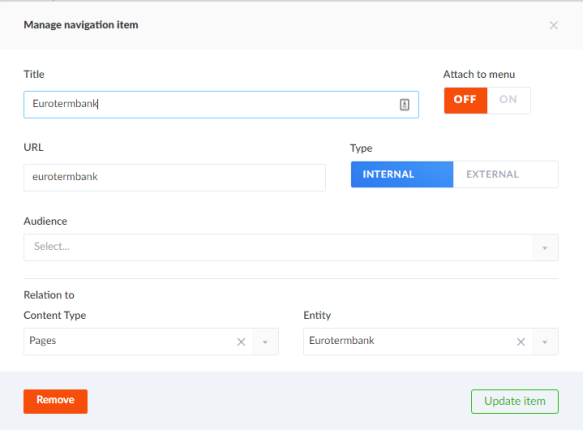

# CMS content creation

Open Toolkit Term Portal (in further text referred simply as Portal) is single place where to create and manage term collections. There are pages in Portal that can be managed by content editors that don't necessary need access to Portal and can be done from Content Management System (further in text - CMS).

### Choice of CMS

Our choice of CMS is [Strapi](https://strapi.io/) - the leading open-source headless CMS. It is easy for developers to adapt it to project needs and easy for content editors to create content.  

### Scope

Following are the content parts that content editor can edit from Portals CMS:
  - Landing page
  - menu at the bottom of the landing page
  - custom pages that you can link in landing page bottom menu
  - news articles

### Loggin in

You can access cms admin panel at:
https://your-cms-url/admin

After loggin in, on the left of the page you will be presented with menu panel where you can reach all the content.

All content items in CMS are built similarly - the have usual fields one would imagine and there are nuances that differ. 

### Pages

Pages section holds a collection of whole page content that can be referred by url. For example Eurotermbank page that can be accessed at https://otktest.tilde.lv/eurotermbank

A page has header where you can manage its title, wether to show it or not, add page background and slug, which is used building pages url.

Page body is made from one or more sections. The section is rich-text editor, similar to one in text editing software.

### Landing page

Landing page body has two special sections - hero and news.
Hero section is where you edit sites welcome text, description and image.

News section are three latest news that you can tur on and off and they are always displayed at the end of the page.

There is a way to add more sections to the page body - after Hero section as well as before it although we don't suggest adding anything before page welcome text.  

### News articles

News articles can be found at Articls section in the top left corner. It has content section as well as Image, Summary and Published date fields. Image and summary are used in news article preview.

### Menu

You can create and manage portal menu from CMS.  
Menu location in cms:  

Only one level menu is supported.

**Adding and editing menu items**

When you want to add new menu item, you click the blue circle button with + icon on it at the bottom of existing menu. A dialog box will open. You can add either internal of external link to your menu. For internal link portals http address will automatically be prepended. Here you can see navigation item for Eurotermbank page:

In this case url will be made from your portal address and URL field value. 
For example: https://otk.tilde.lv/eurotermbank

If you want to add a link to external page, External URL field will be used for menu item address and there will be nothing added to it.

"Attach to menu" switch and "Audience" dropdown is not relevant at this moment.

## Media Library

## CMS user management

## Permissions

## Troubleshooting

This CMS is headless, meaning it provides json rest api as the only way how to provide content to the term portal frontent. Whenever you create a content, you should be able to access it from the url https://your-cms-url/pages/your-page-slug