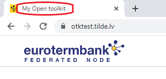

# Term portal branding

While setting up Portals frontend docker image, it is possible to mount a directory that will override nodes default visual settings.  
Directory path to mount:  
/usr/share/nginx/html  
Mounted directory after mounting:  
/usr/share/nginx/html/overrides/  

## Files to override

Summary of files that can be overridden:

- logo-ondark.svg
- logo-onlight.svg
- favicon.ico
- custom-style.css
- settings.json

### Logo and favicon

- logo on light background (Portal landing page)
- logo on dark background (All the other Portal pages except landing)
- favicon - small icon that is showed in the browsers tab next to title.


### Colors

If you put in overrides folder file custom-style.css, you can override main portal colors. Sample file contents are like this:

```css
:root {
  /* buttons, links, icons */
  --primary-color:   #1842B4;
  --primary-button-text-color:#fff;

  --primary-color-darker: #12338b; /* hovered button background color */
  --primary-button-hover-text-color: #fff; /* hovered button text color */


  /* search button */
  --search-button: #ffcc00;;
  --search-button-darker: #dbb003; /* hovered button background color */
  --src-icon-color: #fff; /* The color of search button loupe icon */

  --heading-text-color: #002382;  /* The color of title text */
}

```

This file contains css variable, that are referenced across portal.
Primary color is main accent color and is used in link, button and icon colors. To change its value just change its rgb hex value to something else. To pick the right color a tool like [htmlcolorcodes](https://htmlcolorcodes.com/) can be used.

Example:
```css
--primary-color:   #F2D3FD;
```

If you pick primary color thats contrast ratio with text on it is too low, you might want to change this color to some other than white:

```css
--primary-button-text-color:#BC00FF;
```

Text that is between /* and */ are comments and can be deleted

```
/* this is comment */
```

### Page title

If you put in overrides folder file settings.json, you can adjust your Portal node title that is shown in tab:

Example contents of file settings.json:
```json
{
  "Title": "My Open toolkit"
}
```

The effect of this override:  



## Troubleshooting

All the files should have __exact__ names as mentioned in files to override section.  
To make sure, that overrides work, each of the overriden file should be accessible from web. For example, color overrides:
https://your-portal-node/overrides/custom-style.css